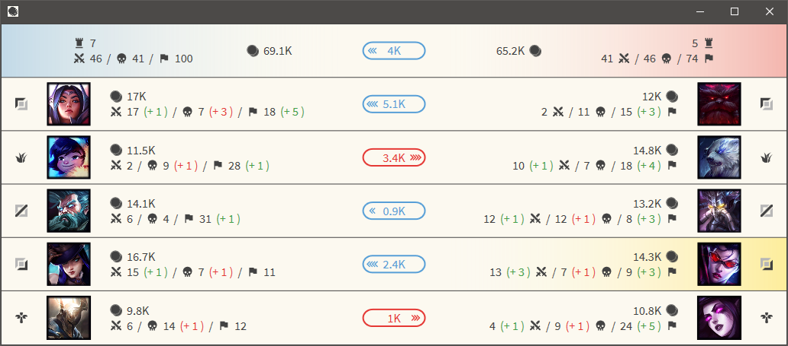

# GoldDiff

_GoldDiff_ is a neat little tool that uses Riot Game's official [Client API](https://developer.riotgames.com/docs/lol#league-client-api) to display and compare the combined item costs of every player - much like the well known LCS gold comparison.

 

 

# How it works

During your games, your League Client publishes various live stats of what is happening ingame.  
In general, these are pretty much the exact same data as you can see in your ingame scoreboard - kills, deaths, items etc.  
_GoldDiff_ reads these data periodically and displays them in a user friendly way that allows you to gain a quick overview of your game's current state.  

## __Important__

_GoldDiff_ __does not__ use any other data besides those that Riot Games officially allows!  
Especially, there is 
* __no__ memory inspection
* __no__ network traffic reading
* __no__ process manipulation

Thus, _GoldDiff_ __does not__ give you any unfair advantage over your opponent and, therefore, is perfectly safe for you to use - _GoldDiff_ __is not__ a Hack!