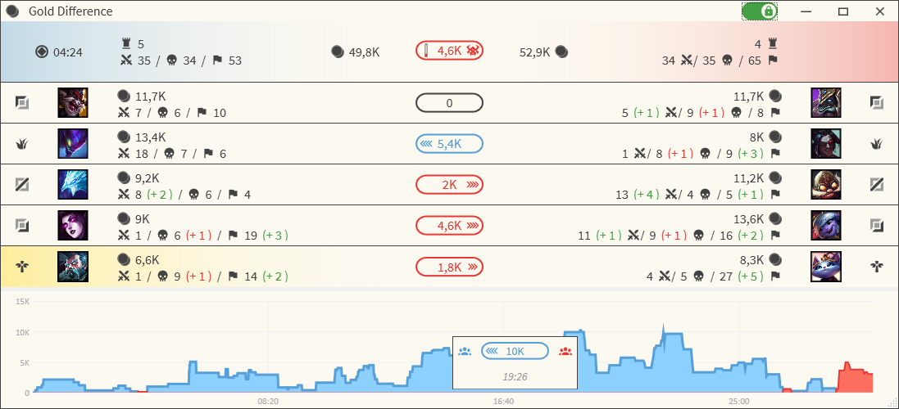

# GoldDiff

_GoldDiff_ is a neat little tool that uses Riot Game's official [Client API](https://developer.riotgames.com/docs/lol#league-client-api) to display and compare the combined item costs of every player - much like the well known LCS gold comparison.

 

 

# Features

1. Compare combined item costs of players based on their position
    * Drag & Drop champion images to re-order players in their respective teams
2. Compare combined item costs of both teams
3. Choose between two different type of gold stats:
    1. "Total Gold" - The combined worth of **all** items in a players inventory
    2. "Non Consumable Only" - The combined worth of items excluding one-time consumable (such as potions and wards)
4. Display every player's stats as well as their "unspent" stats, i.e., kills/assists/deaths since they last purchased an item
    * _GoldDiff_ has no access to the current amount of unspent gold; unspent stats allow for a rough estimation of how much gold players have up their sleeves
    * Both the player stats as well as the unspent stats can be turned off in the settings
    * Also applies to the overall team stats
5. "Power Play" indicator for Baron Nashor and the Elder Dragon
    * _GoldDiff_ displays the relative growth of the gold advantage while the Baron or Elder Dragon Buff is active - much like in pro play!
6. Inhibitor respawn timers
7. Gold advantage over time (Gold Chart)
    * _GoldDiff_ visualizes the gold differences over the duration of your game
    
### Limitations

Currently, _GoldDiff_ supports only games played on Summoners Rift in the classic 5 vs. 5 game mode (including Blind Pick, Draft Pick, Ranked Solo/Duo, Team Ranked, Custom Games, Practice Tool).
Other maps/game modes, such as ARAM oder special event modes, are currently not supported.

# How it works

During your games, your League Client publishes various live stats of what is happening ingame.  
In general, these are pretty much the exact same data as you can see in your ingame scoreboard - kills, deaths, items etc.  
_GoldDiff_ reads these data periodically and displays them in a user friendly way that allows you to gain a quick overview of your game's current state.  

## __Important__

_GoldDiff_ __does not__ use any other data besides those that Riot Games officially allows!  
Especially, there is 
* __no__ memory inspection
* __no__ network traffic reading
* __no__ process manipulation

Thus, _GoldDiff_ __does not__ give you any unfair advantage over your opponent and, therefore, is perfectly safe for you to use - _GoldDiff_ __is not__ a Hack!